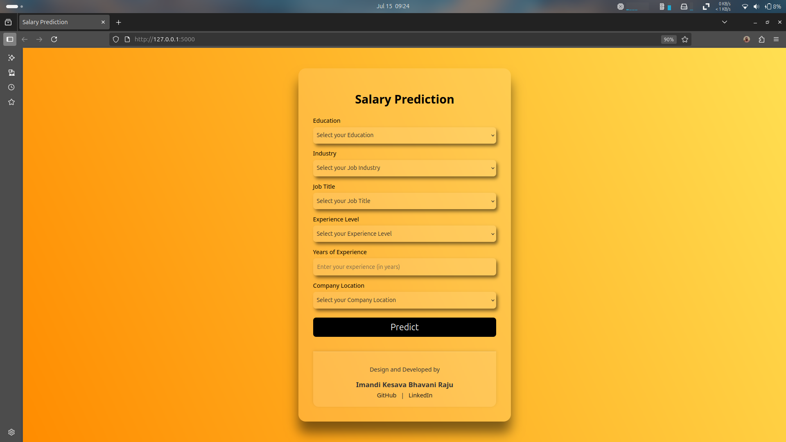

# Salary-Prediction Web App
This project is a **machine learning-based web application** that predicts the salary for various AI-related job roles based on user inputs such as job title, education, experience, industry, and location.
---


## Features
- Predicts salary using a trained ML model (80% R² score)
- Encodes user input via `LabelEncoder` for categorical values
- Clean and modern frontend (HTML, CSS)
- Backend built with Flask
- Model serialized with Pickle
- Gradient UI with custom dropdowns and input styling
---

## Project Structure

```
salary-prediction/
│
├── app.py                       # Flask backend
├── requrements.txt              # Dependencies
│
├── data/                        # Raw CSV datasets
│   ├── ai_job_dataset.csv
│   └── ai_job_dataset1.csv
│
├── models/
│   └── model.pkl                # Trained ML model
│
├── notebook/
│   └── Salary-prediction.ipynb  # Jupyter notebook (training + EDA)
│
├── static/
│   └── style.css                # Custom styles
│
└── templates/
    └── index.html              # Frontend template
```
---

## Installation
### 1. Clone the Repository
```bash
git clone https://github.com/kesavaimandi/Salary-Prediction.git
cd salary-prediction
```
### 2. Install Dependencies
```bash
pip install -r requrements.txt
```
---

## Run the App

```bash
python app.py
```

Visit: [http://127.0.0.1:5000](http://127.0.0.1:5000) in your browser.

---

## Model Information

- Algorithm used: Random Forest
- Input features: `education`, `industry`, `job title`, `experience level`, `years of experience`, `company location`
- Target: Salary prediction
- Performance: ~80% R² Score

---

## Developer

**Designed & Developed by: Imandi Kesava Bhavani Raju**

- [GitHub](https://github.com/kesavaimandi)
- [LinkedIn](https://www.linkedin.com/in/imandi-kesava)

---
